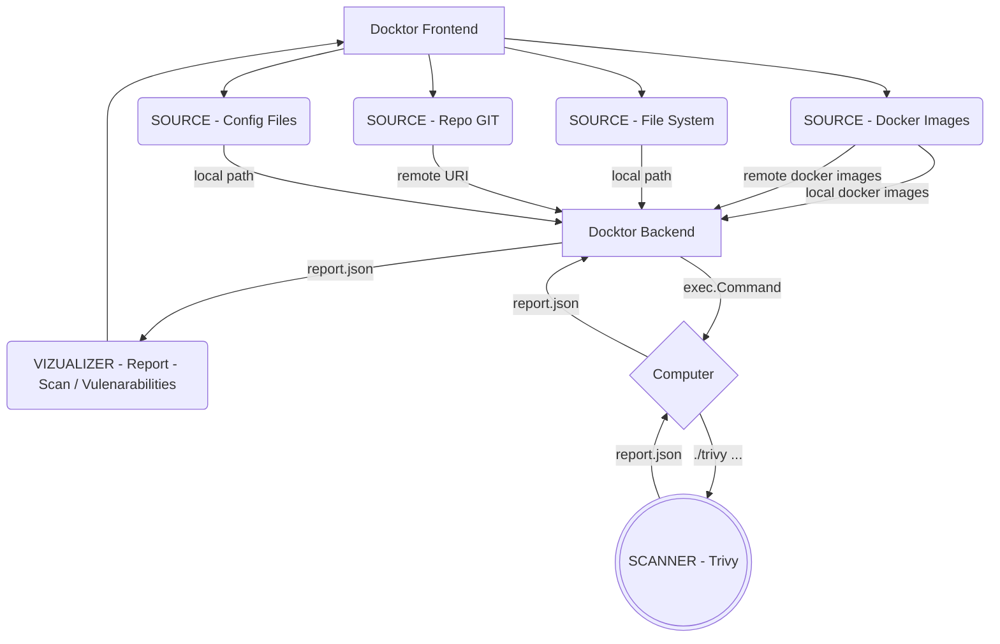

<div align="center">
    <h1> Docktor</h1>
    <h2> Analyze your Dev environment with surgical precision </h2>
<div>


<div align="left">

## About

Docktor is a Web App that deploys an easy-to-use kit of analysis and scanning tools.

Today, developers use a variety of resources. It is more and more difficult to ensure the security of our artifacts.
Especially Docker environments which are an obvious source of vulnerability.


> **The objective is to have a simple, fast, lightweight and everywhere approach to ensure the security of our productions.**

<div align="center">

### The Docktor Kit Composition


</div>

## Features

> **The user interacts through the simple and pure web application, to select the elements he wants to analyze.**

Docktor takes care of the remaining work thanks to its 3 main components:

- **Sources**: are UIs to select the sources/artifacts/input folders that will be analyzed by the Scanners
- **Scanners**: are external tools that perform the processing
- **Vizualizer**: are UIs that are in charge of enhancing the data for the user



### [SOURCE] - Docker Images - SCA (Software Compisotion Analysis)


- Trivy detects:

  - Vulnerabilities

    - OS packages (Alpine, Red Hat Universal Base Image, Red Hat Enterprise Linux, CentOS, AlmaLinux, Rocky Linux, CBL-Mariner, Oracle Linux, Debian, Ubuntu, Amazon Linux, openSUSE Leap, SUSE Enterprise Linux, Photon OS and Distroless)

    - Language-specific packages (Bundler, Composer, Pipenv, Poetry, npm, yarn, Cargo, NuGet, Maven, and Go)

<br>
<br>
<br>

<details><summary>CLICK HERE TO VIEW RESULTS</summary>

<br>


</details>

<br>
<br>
<br>

### [SOURCE] - File System - SCA (Software Compisotion Analysis)


- Trivy detects:

  - Vulnerabilities

    - OS packages (Alpine, Red Hat Universal Base Image, Red Hat Enterprise Linux, CentOS, AlmaLinux, Rocky Linux, CBL-Mariner, Oracle Linux, Debian, Ubuntu, Amazon Linux, openSUSE Leap, SUSE Enterprise Linux, Photon OS and Distroless)

    - Language-specific packages (Bundler, Composer, Pipenv, Poetry, npm, yarn, Cargo, NuGet, Maven, and Go)

<br>
<br>
<br>

<details><summary>CLICK HERE TO VIEW RESULTS</summary>

<br>


</details>

<br>
<br>
<br>

### [SOURCE] - Config Files - Misconfigurations Analysis


- Trivy detects:

  - Misconfigurations
    - Kubernetes
    - Docker
    - Terraform
    - CloudFormation
    - etc.
  - Secrets
    - AWS access key
    - GCP service account
    - GitHub personal access token
    - etc.

<br>
<br>
<br>

<details><summary>CLICK HERE TO VIEW RESULTS</summary>

<br>


</details>

<br>
<br>
<br>

### [SOURCE] - Repo GIT - SCA (Software Compisotion Analysis)


- Trivy detects:

  - Vulnerabilities

    - OS packages (Alpine, Red Hat Universal Base Image, Red Hat Enterprise Linux, CentOS, AlmaLinux, Rocky Linux, CBL-Mariner, Oracle Linux, Debian, Ubuntu, Amazon Linux, openSUSE Leap, SUSE Enterprise Linux, Photon OS and Distroless)

    - Language-specific packages (Bundler, Composer, Pipenv, Poetry, npm, yarn, Cargo, NuGet, Maven, and Go)

<br>
<br>
<br>

<details><summary>CLICK HERE TO VIEW RESULTS</summary>

<br>


</details>

<br>
<br>
<br>

## Getting started

### Run with - Docker compose (Preferred method)

```
curl -LJO https://github.com/Matbabs/Docktor/blob/main/docker-compose.yml
```

Inside the `docker-compose.yml` containing folder.

```
docker-compose up
```

> Note: your `/home` path is map with the `/home` container path, especially to scan and access your local files.

<br>

<details><summary>Run with - Docker run</summary>

<br>

### Run with - Docker run

```
docker run \
    -d \
    -p 3030:80 \
    -p 4040:4040 \
    -v "/var/run/docker.sock:/var/run/docker.sock:rw" \
    -v /home:/home \
    docktor
```

</details>

<br>

### Access UI

**Connect on: http://localhost:3030**
